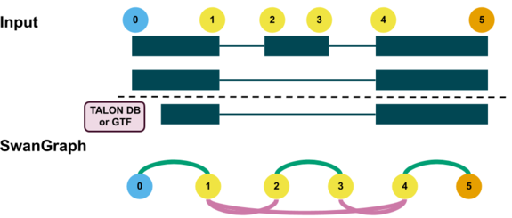
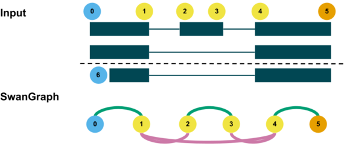
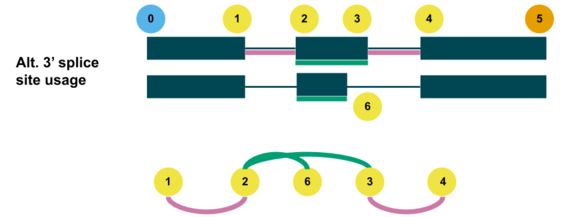
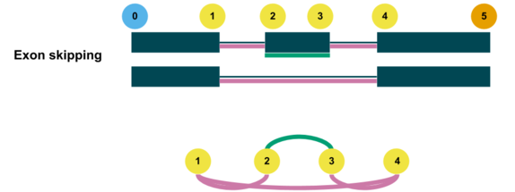
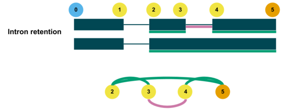

# Understanding Swan visualizations

Swan utilizes a representation of transcript structure and alternative splicing that most people aren't familiar with. The goal of this guide is to help the user understand and interpret the graphical output format from Swan, in a step-by-step manner.

## Table of contents

* [Basics](understanding_swan_vis.md#basics)
* [Alternative splice site usage](understanding_swan_vis.md#alternative-splice-site-usage)
* [Exon skipping and intron retention](understanding_swan_vis.md#exon-skipping-and-intron-retention)

## Basics

### 1. Swan pulls transcript models from a GTF or TALON database

### 2. Swan assigns a node to each unique splice site. Blue nodes are transcription start sites, orange nodes are transcription end sites, and yellow nodes are internal splice sites.

### 3. Splice junction pairs that span an exon are connected by exonic \(green\) edges. Splice junction pairs that span an intron are connected by intronic \(pink\) edges.

### 4. Datasets containing additional transcript models can be added.

### 5. New nodes correspond to splice sites not seen in the transcript models already in the SwanGraph.

### 6. Finally, new edges are added to connect the new nodes to the preexisting SwanGraph.

## Alternative splice site usage

Similarly, phenomena such as alternative 5'/3', and TSS/TES usage can be visualized from the SwanGraph.

Alternative 5' splice site usage for an exon can be seen when there are multiple incoming exonic \(green\) edges into a splice site that represents the start of an intron.

Alternative 3' splice site usage for an exon can be seen when there are multiple outgoing exonic \(green\) edges from a splice site that represents the end of an intron. 

## Exon skipping and intron retention

Once you are used to looking at SwanGraphs, you can start noticing interesting splicing patterns, such as exon skipping and intron retention.

Exon skipping in a SwanGraph consists of an intronic \(pink\) edge that completely spans an exonic \(green\) edge. This means that an exonic region of a one transcript model has been completely skipped over in another transcript model 

In a SwanGraph, intron retention is the opposite of exon skipping. It is seen when an exonic \(green\) edge completely spans an intronic \(pink\) edge. This means that an intronic region from one transcript model has been included in a different transcript model. 

