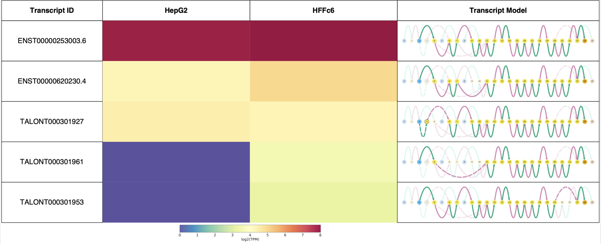
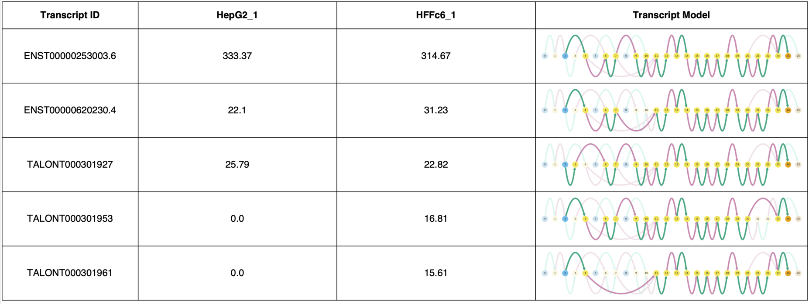

# Visualization

Swan offers many different visualization options to understand your transcriptomes. This tutorial includes instructions on the following:

Table of contents

* [Gene summary graphs](visualization.md#gene-summary-graphs)
* [Transcript path graphs](visualization.md#transcript-path-graphs)
* [Saving a figure](visualization.md#saving-a-figure)
* [Swan reports](visualization.md#swan-reports)

```python
%matplotlib inline
import swan_vis as swan

# code to download this data is in the Getting started tutorial
sg = swan.SwanGraph('data/swan.p')
```

## Gene summary graphs

Gene summary graphs display a high-level summary of the complexity of splicing within a certain gene locus. All observed splice sites and splice junctions from input datasets, and the annotation \(if added\) are plotted in full color. Genes can be called to be plotted either using their gene ids or gene names, but we recommend using gene ids as we have encountered redundant gene names during testing.

```python
sg.plot_graph('ADRM1')
```


Gene summary graphs are a type of graph plot and therefore have plotting options that allow the user to highlight nodes and edges that are either not present in the annotation \(`indicate_novel`\) or those that come from a specific dataset \(`indicate_dataset`\).

For instance, say we want to highlight the nodes and edges that are not seen in the annotation. In this representation, nodes \(splice sites\) that are not present in the annotation will appear outlined, and intronic or exonic regions \(edges\) that are not present in the annotation will appear dashed.

```python
# plot a gene summary graph with novel splice sites and 
# splice junctions plotted as outlined nodes and dashed edges respectively
sg.plot_graph('ADRM1', indicate_novel=True)
```


Similarly, you can highlight the nodes that come from a specific dataset. Outlined nodes and dashed edges are those that are present in the queried dataset.

```python
# plot a gene summary graph with splice sites and splice junctions
# that are present in the indicated dataset as outlined nodes
# and dashed edges respectively
sg.plot_graph('ADRM1', indicate_dataset='HepG2_1')
```


If you're plotting with Swan from a `.py` file or from the terminal and want to see your plot as it is generated, use the display argument to `plot_graph`.

```python
# plot a gene summary graph and immediately display it during
# code execution
sg.plot_graph('ADRM1', indicate_novel=True, display=True)
```


## Transcript path graphs

Transcript path graphs display the same structure as gene summary graphs but gray out nodes and edges \(splice sites and intronic/exonic regions\) that are not present in the given transcript. In this case, the transcript id field is needed to plot the path.

```python
# plot the path of a specific transcript through its parent gene
# summary graph for a given transcript
sg.plot_transcript_path('TALONT000301953')
```


There are also `indicate_novel` and `indicate_dataset` options that allow the user to highlight the nodes and edges that are not present in the annotation.

```python
# plot the path of a specific transcript through its parent gene summary
# graph for a given transcript
# plot novel splice sites as outlined nodes
# plot novel splice junctions as dashed edges
sg.plot_transcript_path('TALONT000301953', indicate_novel=True)
```


```python
# plot the path of a specific transcript through its parent gene summary
# graph for a given transcript
# plot splice sites from the given dataset as outlined nodes
# plot splice junctions from the given dataset as dashed edges
sg.plot_transcript_path('TALONT000301953', indicate_dataset='HFFc6_1')
```


For transcripts, there is also a unique option that allows you to generate the genome-browser style representation of a transcript, using the `browser` option.

```python
# plot the traditional browser-style representation 
# for a given transcript
sg.plot_transcript_path('TALONT000301953', browser=True)
```


`plot_transcript_path()` can also take the display argument for users that are interested in seeing their plots as they are being generated.

```python
# plot a transcript's path and immediately display it during
# code execution
sg.plot_transcript_path('TALONT000301953', browser=True, display=True)
```


## Saving a figure

Saving a figure in Swan for `plot_graph` and for `plot_transcript_path` can be done in two different ways.

The first way involves calling `save_fig` after your figure has been generated. This method allows you to give your figure whatever name you want.

```python
# plot gene summary graph for a given gene
sg.plot_graph('ADRM1')
# save the currently-plotted figure with the given filename and location
swan.save_fig('figures/my_gene_summary.png')
```


The second way only requires one line of code and requires that the user pass the corresponding plotting function a `prefix` for the filename and path. The file will be automatically named according to the settings in the graph.

```python
# plot a gene summary graph with novel splice sites and junctions
# outlined and dashed respectively
# save the figure with the given prefix
sg.plot_graph('ADRM1', indicate_novel=True, prefix='figures/adrm1')
```

As you can see, here the gene name ADRM1 is not used to save the figure because we have encountered conflicing gene names in our internal use of Swan. To avoid these clashes, Swan automatically fetches the gene id associated with the first instance of the gene name it finds and uses it to save the graph, in the interest of not accidentally overwriting a preexisting file. 


## Swan reports

Swan reports display all the expressed transcripts in a given gene in a PDF format. There are many ways to customize these reports so here are a few. Unlike the above plotting options, the user must provide a `prefix` argument as there are many files that must be automatically generated to create the report.

Here's the one shown in the paper.

```python
# generate a report for the given gene 
# save it with the given filepath prefix
# display abundance information in the form of a heatmap
# include differential transcript expression test significance results
# (defaults to significance threshold q >= 0.05)
# display the novelty category associated with the transcript 
# display novel splice sites and junctions 
# as outlined nodes and dashed edges respectively
sg.gen_report('ADRM1',
              prefix='figures/adrm1_paper',
              heatmap=True,
              include_qvals=True,
              novelty=True, 
              indicate_novel=True)
```


```python
# generate a report for the given gene 
# save it with the given filepath prefix
# combine datasets using the input dataset groupings and group names
# display abundance information in the form of a heatmap
# display novel splice sites and junctions 
# as outlined nodes and dashed edges respectively
sg.gen_report('ADRM1', prefix='figures/adrm1',
              dataset_groups=[['HepG2_1','HepG2_2'],['HFFc6_1','HFFc6_2']],
              dataset_group_names=['HepG2', 'HFFc6'],
              heatmap=True,
              indicate_novel=True)
```



```python
# generate reports for the given genes
# with the given prefix
# only display the input datasets
# display abundance information as TPM numbers
# order the entries in the report by the genomic coordinate
# of each transcript's transcription start site (TSS)
sg.gen_report(['ADRM1','PSAP'], prefix='figures/multi_gene',
            datasets=['HepG2_1', 'HFFc6_1'],
            tpm=True,
            order='TSS')
```




```python
# generate reports for the given gene
# with the given prefix
# display abundance information as a heatmap
# include differential transcript expression test significance results
# use significance threshold q >= 0.1
# use the browser-style representation as the transcript visualization
sg.gen_report('ADRM1', prefix='figures/adrm1',
             heatmap=True,
             include_qvals=True, q=0.1,
             browser=True)
```

